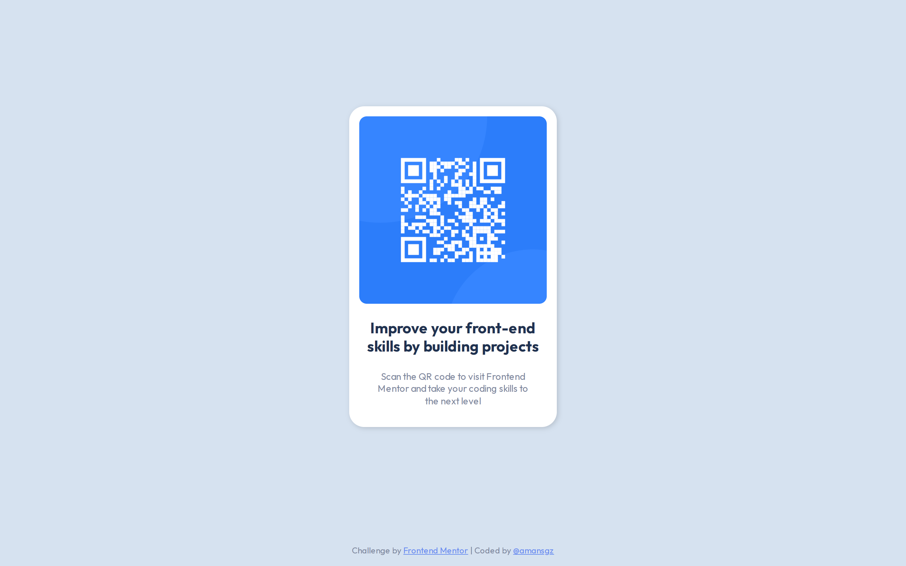

# Frontend Mentor Challenges

[Frontend Mentor challenges](https://www.frontendmentor.io/) help you improve your coding skills by building realistic projects.

## Table of Content

- [Newbie challenges solutions](#newbie-challenges-solutions)

## Newbie challenges solutions

- [css-qr-code-component](#qr-code-component)
- [css-order-summary-component](#order-summary-component)
- [css-stats-preview-card-component](#stats-preview-card-component)
- [css-landing-page-with-intro-section](#landing-page-with-intro-section)
- [css-single-price-grid-component](#single-price-grid-component)
- [css-nft-preview-card](#nft-preview-card-component)
- [css-grid-four-cards-section](#grid-four-cards-section)
- [css-base-apparel-coming-soon](#base-apparel-coming-soon)
- [css-intro-component-with-sign-up-form](#intro-component-with-sign-up-form)
- [css-profile-card-component](#profile-card-component)
- [css-social-proof-section](#social-proof-section)
- [css-article-preview-component](#article-preview-component)
- [css-interactive-rating-component](#interactive-rating-component)
- [css-results-summary-component](#results-summary-component)

- [bootstrap-product-preview-card](#product-preview-card)
- [bootstrap-ping-coming-soon-page](#ping-coming-soon-page)
- [scss-faq-accordion-card](#faq-accordion-card)
- [react-3-column-card-component](#3-column-card-component)

### QR Code Component 
| Built with CSS |
| :---         |  
| [live site /](https://amansgz.github.io/css-qr-code-component/)  [code](https://github.com/amansgz/css-qr-code-component)  |
|  |

### Order Summary Component
| Built with CSS |
| :---         |    
| [live site /](https://amansgz.github.io/css-order-summary-component/)  [code](https://github.com/amansgz/css-order-summary-component)  | 
|    | 

### Stats Preview Card Component
| Built with CSS |
| :---         |    
| [live site /](https://amansgz.github.io/css-stats-preview-card-component/)  [code](https://github.com/amansgz/css-stats-preview-card-component)  | 
|    | 

### Landing Page With Intro Section
| Built with CSS |
| :---         |    
| [live site /](https://amansgz.github.io/css-landing-page-with-intro-section/)  [code](https://github.com/amansgz/css-landing-page-with-intro-section)  | 
|    | 

### Single Price Grid Component
| Built with CSS |
| :---         |    
| [live site /](https://amansgz.github.io/css-single-price-grid-component/)  [code](https://github.com/amansgz/css-single-price-grid-component)  | 
|    | 

### NFT Preview Card Component
| Built with CSS |
| :---         |  
| [live site /](https://amansgz.github.io/css-nft-preview-card/)  [code](https://github.com/amansgz/css-nft-preview-card)  | 
|    | 

### Grid Four Cards Section
| Built with CSS |
| :---         |    
| [live site /](https://amansgz.github.io/css-grid-four-cards-section/)  [code](https://github.com/amansgz/css-grid-four-cards-section)  | 
|    | 

### Base Apparel Coming Soon
| Built with CSS |
| :---         |    
| [live site /](https://amansgz.github.io/css-base-apparel-coming-soon/)  [code](https://github.com/amansgz/css-base-apparel-coming-soon)  | 
|    | 

### Intro Component with Sign Up Form
| Built with CSS |
| :---         |    
| [live site /](https://amansgz.github.io/css-intro-component-with-sign-up-form/)  [code](https://github.com/amansgz/css-intro-component-with-sign-up-form)  | 
|    | 

### Profile Card Component
| Built with CSS |
| :---         |    
| [live site /](https://amansgz.github.io/css-profile-card-component/)  [code](https://github.com/amansgz/css-profile-card-component)  | 
|    | 

### Social Proof Section
| Built with CSS |
| :---         |    
| [live site /](https://amansgz.github.io/css-social-proof-section/)  [code](https://github.com/amansgz/css-social-proof-section)  | 
|    | 

### Article Preview Component
| Built with CSS |
| :---         |    
| [live site /](https://amansgz.github.io/css-article-preview-component/)  [code](https://github.com/amansgz/css-article-preview-component)  | 
|    | 

### Interactive Rating Component
| Built with CSS |
| :---         |    
| [live site /](https://amansgz.github.io/css-interactive-rating-component/)  [code](https://github.com/amansgz/css-interactive-rating-component)  | 
|    | 

### Results Summary Component 
| Built with CSS |
| :---         |    
| [live site /](https://amansgz.github.io/css-results-summary-component/)  [code](https://github.com/amansgz/css-results-summary-component)  | 
|    | 

### Product Preview Card
| Built with BOOTSTRAP |
| :---         |    
| [live site /](https://amansgz.github.io/bootstrap-product-preview-card/)  [code](https://github.com/amansgz/bootstrap-product-preview-card)  | 
|    | 

### Ping Coming Soon Page
| Built with BOOTSTRAP |
| :---         |    
| [live site /](https://amansgz.github.io/bootstrap-ping-coming-soon-page/)  [code](https://github.com/amansgz/bootstrap-ping-coming-soon-page)  | 
|    | 

### FAQ Accordion Card 
| Built with SCSS |
| :---         |
| [live site /](https://scss-faq-accordion-card.netlify.app/)  [code](https://github.com/amansgz/scss-faq-accordion-card)  | 
|    | 

### 3 Column Card Component
| Built with REACT |
| :---         |    
| [live site /](https://react-3-column-card.netlify.app/)  [code](https://github.com/amansgz/react-3-column-card-component)  | 
|    | 